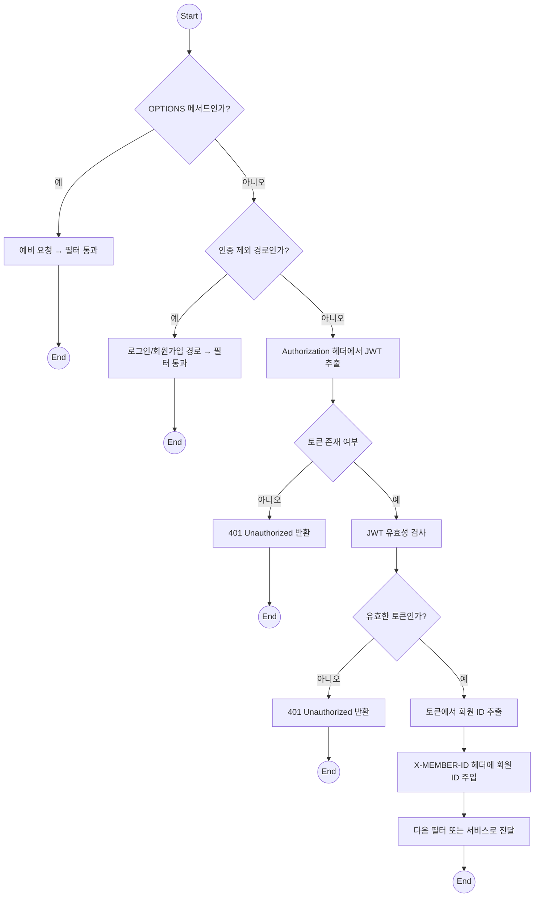

```mermaid
flowchart TD
    start((Start))

    %% CORS 예외 처리 흐름
    start --> methodCheck{OPTIONS 메서드인가?}
    methodCheck -- 예 --> bypassCORS[예비 요청 → 필터 통과]
    bypassCORS --> end1((End))

    %% 인증 제외 경로 체크
    methodCheck -- 아니오 --> pathCheck{인증 제외 경로인가?}
    pathCheck -- 예 --> skipAuth[로그인/회원가입 경로 → 필터 통과]
    skipAuth --> end2((End))

    %% JWT 토큰 추출 및 검증
    pathCheck -- 아니오 --> extractToken["Authorization 헤더에서 JWT 추출"]
    extractToken --> hasToken{토큰 존재 여부}
    
    hasToken -- 아니오 --> reject1[401 Unauthorized 반환]
    reject1 --> end3((End))

    hasToken -- 예 --> validateToken[JWT 유효성 검사]
    validateToken --> isValid{유효한 토큰인가?}

    isValid -- 아니오 --> reject2[401 Unauthorized 반환]
    reject2 --> end4((End))

    isValid -- 예 --> extractId["토큰에서 회원 ID 추출"]
    extractId --> addHeader["X-MEMBER-ID 헤더에 회원 ID 주입"]
    addHeader --> forward[다음 필터 또는 서비스로 전달]
    forward --> end5((End))
```

